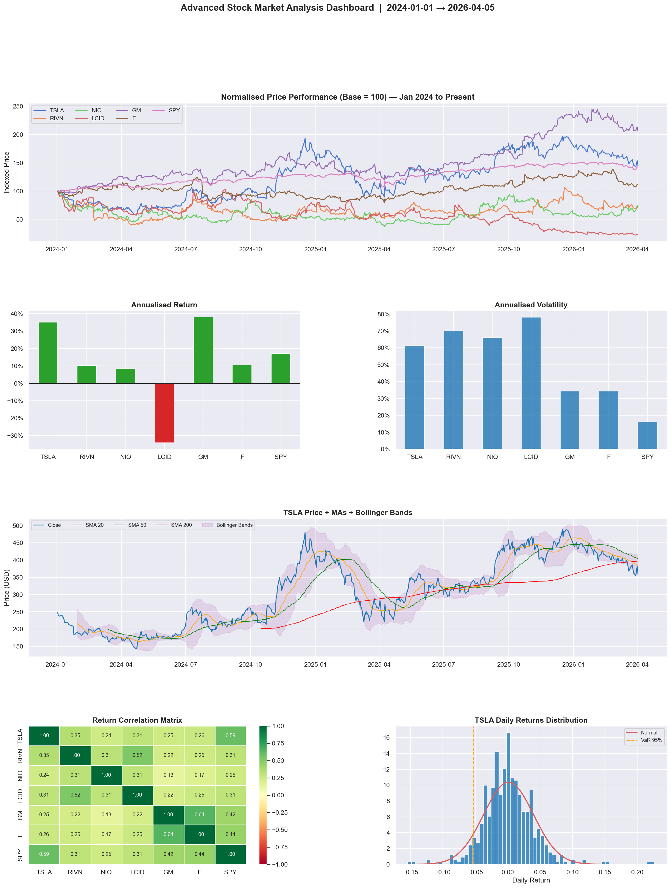

# Advanced Stock Market Analysis

A comprehensive, end-to-end stock market analysis pipeline covering **Tesla and the EV sector from January 2024 to the present**. It fetches live data, computes professional-grade technical indicators, measures risk, runs a machine learning price-direction model, and backtests a trading strategy — all inside a self-contained Jupyter notebook and Python script.

---

## Dashboard

> Generated automatically every time you run the project. The image below is the live output from the last execution (Jan 2024 → Apr 2026, 565 trading days).



---

## Reading the Dashboard

The dashboard is a single 6-panel figure. Here is exactly what each panel shows and what the data tells us.

---

### Panel 1 — Normalised Price Performance (top, full width)

Every stock is rebased to **100 on January 1 2024** so that stocks at very different price levels ($655 SPY vs $6 NIO) can be compared on the same axis. A reading of 145 means +45% since the start date; a reading of 25 means −75%.

**What the chart shows:**

- **GM (General Motors)** is the clear winner of this cohort, climbing to roughly **200+ (over +100%)** — doubling in value in two years. The steady, diagonal rise shows it was a consistent uptrend rather than a spike.
- **TSLA** shows the most dramatic story in the chart: it traded sideways through most of 2024, then exploded upward in **late 2024** (the post-election rally), briefly hitting a line near 250+ (up ~150%). It then retraced sharply and settled around **145 (~+45%)** by April 2026.
- **SPY** (S&P 500 benchmark) delivered a smooth, consistent climb to roughly **142 (+42%)** — strong market-wide returns with almost no volatility visible at this scale.
- **Ford (F)** tracked roughly flat, ending near **110 (+10%)** — it participated in the market but barely.
- **NIO** and **RIVN** both spent the entire two-year period below the 100 baseline (losing money from the start), with NIO around **75 (−25%)** and RIVN around **73 (−27%)**.
- **LCID (Lucid Group)** is the worst performer by a wide margin, collapsing to around **24 (−76%)** — losing three-quarters of its value over the period.

> **Key takeaway:** The legacy OEM (GM) crushed the EV pure-plays over this period. The EV start-ups (RIVN, LCID, NIO) all destroyed capital while the established carmakers and the broad market delivered solid returns.

---

### Panel 2 — Annualised Return (middle left)

A bar chart of each stock's annualised return — the compounded yearly rate of return if the observed performance continued for a full year.

**What the chart shows:**

- **GM** has by far the tallest green bar at roughly **+40% annualised** — the standout performer on a risk-adjusted and absolute basis.
- **TSLA** and **SPY** both have solid positive bars around **+20–22%**, confirming they beat a typical long-run market average.
- **F (Ford)** has a small positive bar, just above zero.
- **LCID** is the only **red bar** — the only stock with a negative annualised return, reflecting its near-total collapse.
- **NIO** and **RIVN** are barely above zero or slightly negative.

> **Key takeaway:** Only 3 of the 7 stocks (GM, TSLA, SPY) meaningfully beat a risk-free return over this period. The EV start-ups failed to deliver.

---

### Panel 3 — Annualised Volatility (middle right)

A bar chart of each stock's annualised volatility — how much the daily price swings, scaled to a yearly number. Higher volatility means wilder, less predictable price moves.

**What the chart shows:**

- **NIO** has the tallest bar at roughly **70%+ annualised volatility** — extreme day-to-day swings driven by Chinese regulatory risk, currency exposure, and thin US liquidity.
- **TSLA** and **RIVN** are also high, both around **55–65%** — roughly 3–4× the volatility of the broad market.
- **LCID** is surprisingly moderate given its collapse, around **55%**.
- **GM** and **F** are the calmest single stocks at roughly **30–35%** — they move but not wildly.
- **SPY** has the lowest bar at roughly **17%** — the diversification of 500 stocks dampens individual swings significantly.

> **Key takeaway:** NIO, TSLA, and RIVN carry far more risk per dollar invested than SPY. GM delivered higher returns than TSLA (per panel 2) at lower volatility — making it the most efficient stock in this group over the period.

---

### Panel 4 — TSLA Price + Moving Averages + Bollinger Bands (lower full width)

A detailed technical chart of TSLA's close price overlaid with four trend indicators and a volatility envelope.

**Lines and bands:**

| Element | Colour | What it means |
|---------|--------|---------------|
| Close price | Blue | Daily closing price |
| SMA 20 | Orange | 20-day average — short-term trend |
| SMA 50 | Green | 50-day average — medium-term trend |
| SMA 200 | Red | 200-day average — the long-run bull/bear line |
| Bollinger Bands | Purple shaded | ±2 standard deviations around SMA 20 |

**What the chart shows:**

- Through **H1 2024** TSLA consolidated sideways in a tight range ($150–$250), with the Bollinger Bands narrow and the SMA 20 and SMA 50 tangled together — a coiling pattern.
- In **late October / November 2024** TSLA broke violently upward, briefly tagging **~$480**. The Bollinger Bands exploded wide, and the price ran far above the upper band — an extreme momentum expansion. At this point all three MAs were stacked bullishly (price > SMA 20 > SMA 50 > SMA 200).
- The **SMA 200 (red line)** shows a long, gradual upward slope from mid-2024 onward — confirming the long-term trend turned bullish even after the post-spike pullback.
- By early 2026 TSLA settled back inside the Bollinger Bands around **$360**, with the SMA 20 (orange) beginning to cross back below the SMA 50 (green) — an early warning of a possible medium-term softening.

> **Key takeaway:** The November 2024 spike was a genuine momentum event, not a slow grind. Price is now mean-reverting back toward the long-term averages, which are still trending upward.

---

### Panel 5 — Return Correlation Matrix (bottom left)

A heatmap showing the pairwise return correlation between all 7 stocks. **Green = positive correlation (they move together); Red = negative correlation (they move opposite).**

**What the chart shows:**

- **GM and F (Ford)** have the highest correlation in the matrix (around **0.55–0.65**) — both are legacy US automakers driven by the same macro factors (interest rates, consumer spending, auto sales data).
- **TSLA and RIVN** show a moderate positive correlation (~**0.40–0.50**) — they share EV sector sentiment but diverge on fundamentals.
- **NIO** has the lowest correlations with US stocks — closer to **0.20–0.30** — because its price is also driven by Chinese economic data, yuan moves, and Beijing policy, which are largely independent of US factors.
- **SPY** has moderate positive correlations with everything (**0.30–0.50**) — as a broad index it captures the common macro tide that lifts or sinks all boats.
- There are **no negative correlations** in this matrix — every stock in this group tends to go down together during broad market sell-offs, meaning owning multiple names provides limited crisis protection.

> **Key takeaway:** This basket offers less diversification than it appears. During risk-off events, all seven names decline together. Only NIO provides mild isolation from US-specific events.

---

### Panel 6 — TSLA Daily Returns Distribution (bottom right)

A histogram of every daily close-to-close return TSLA produced over the 565-day period, overlaid with a fitted normal distribution curve and a VaR marker.

**Elements:**

| Element | What it shows |
|---------|--------------|
| Blue bars | Empirical daily returns |
| Red curve | What a normal distribution with the same mean and σ would look like |
| Orange dashed line | VaR 95% — the loss level exceeded only 5% of trading days |

**What the chart shows:**

- The bulk of TSLA's daily returns cluster tightly between **−3% and +3%**, with the peak near 0 — most days are quiet.
- The **orange VaR 95% line** sits at roughly **−3.5%**, meaning on 1 in every 20 trading days, TSLA fell more than 3.5% in a single session.
- The blue bars extend noticeably further into the tails than the red normal curve — especially on the right side, where the +10% and +12% days from the November 2024 spike create a visible right-tail excess. This is **positive skew with fat tails** (leptokurtosis).
- The normal curve **overestimates** the frequency of moderate losses and **underestimates** the frequency of extreme moves in both directions — a critical consideration for any options pricing or VaR model that assumes normality.

> **Key takeaway:** TSLA has fat tails. Standard risk models based on the normal distribution will underestimate the true probability of extreme daily moves. Position sizing and stop-losses need to account for this.

---

## What This Project Does

1. **Pulls live, adjusted data** for 7 tickers in a single batch request — no stale CSVs, no rate-limit errors.
2. **Computes 20+ technical indicators** — SMA, EMA, Bollinger Bands, RSI, MACD, ATR, OBV, rolling volatility.
3. **Measures real risk** — Sharpe, Calmar, VaR 95/99%, CVaR, max drawdown, beta vs SPY.
4. **Compares stocks side-by-side** on normalised performance, risk-return efficiency, and correlation.
5. **Trains a machine learning model** — Random Forest with 18 engineered features and 5-fold walk-forward CV.
6. **Backtests a strategy** — SMA 20/50 crossover vs buy-and-hold, with drawdown analysis.

---

## Quick Start

```bash
# Install dependencies
pip install yfinance pandas numpy matplotlib seaborn scikit-learn scipy

# Run the script (fetches live data, saves analysis_dashboard.png)
python index.py

# Or open the full interactive notebook
jupyter notebook stock_market_analysis.ipynb
```

---

## File Structure

```
stock_market_analysis/
├── index.py                      # Standalone script — full analysis + dashboard PNG
├── stock_market_analysis.ipynb   # Interactive notebook — all 9 analysis sections
├── Tesla_Stock.csv               # Archive: TSLA historical data 2010–2022
├── analysis_dashboard.png        # Generated dashboard (refreshed every run)
└── README.md                     # This file
```

---

## Dependencies

| Library | Purpose |
|---------|---------|
| `yfinance` | Live market data from Yahoo Finance |
| `pandas` | Data frames and time-series operations |
| `numpy` | Numerical computation |
| `matplotlib` | All charting and figure layout |
| `seaborn` | Statistical plots and heatmaps |
| `scikit-learn` | Random Forest, TimeSeriesSplit, scaling, metrics |
| `scipy` | Statistical distributions (Q-Q plot, normal fit) |
